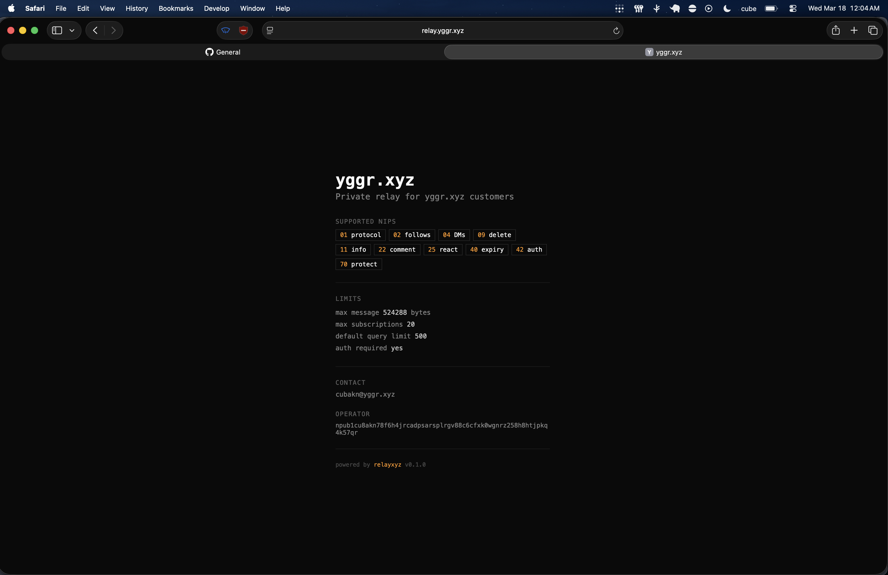

# relayxyz

Lightweight, short note, Nostr relay in Rust.



## Features

- **NIP-42 auth + whitelist.** Opt-in. Clients prove identity, relay checks pubkey against a whitelist managed via admin API. Wire it to payments, invites, whatever
- **Short notes.** Kind 1 capped at 180 graphemes. This is a relay for old school Twitter-length posts, not longform content
- **Opinionated policy.** Small kind allowlist, per-pubkey rate limiting, future timestamp rejection. The defaults are the product
- **Single binary.** [redb](https://github.com/cberner/redb) storage, under 2,500 lines of Rust

## Supported NIPs

[01](https://github.com/nostr-protocol/nips/blob/master/01.md), [02](https://github.com/nostr-protocol/nips/blob/master/02.md), [04](https://github.com/nostr-protocol/nips/blob/master/04.md), [09](https://github.com/nostr-protocol/nips/blob/master/09.md), [11](https://github.com/nostr-protocol/nips/blob/master/11.md), [18](https://github.com/nostr-protocol/nips/blob/master/18.md), [22](https://github.com/nostr-protocol/nips/blob/master/22.md), [25](https://github.com/nostr-protocol/nips/blob/master/25.md), [40](https://github.com/nostr-protocol/nips/blob/master/40.md), [42](https://github.com/nostr-protocol/nips/blob/master/42.md), [51](https://github.com/nostr-protocol/nips/blob/master/51.md), [65](https://github.com/nostr-protocol/nips/blob/master/65.md), [70](https://github.com/nostr-protocol/nips/blob/master/70.md)

## Quick start

No code to write. Copy the example env file, fill in your details, and run:

```bash
cp .env.example .env
# edit .env with your relay name, description, pubkey, etc.
cargo run --release
```

Every setting has a sensible default. The only file you need to touch is `.env`. Listens on `0.0.0.0:7777` by default.

## How it works

Open writes by default. Set `RELAY_REQUIRE_AUTH=true` to make it invite-only: clients must pass NIP-42 auth on connect, and their pubkey must be whitelisted via the admin API to publish. Reads are always open.

Here's how it works end-to-end, using [yggr.xyz](https://yggr.xyz) and [Damus](https://damus.io) as examples:

```
yggr.xyz ── POST /admin/pubkey ──→ relay
                                     │
                                pubkey whitelisted
                                     │
─ ─ ─ ─ ─ ─ ─ ─ ─ ─ ─ ─ ─ ─ ─ ─ ─ ─ ─ ─ ─ ─ ─ ─ ─
Damus connects via WebSocket
                                     │
Damus ←─── AUTH challenge ────── relay
Damus ──── AUTH (kind 22242) ──→ relay
                                     │
                                pubkey authenticated
                                     │
─ ─ ─ ─ ─ ─ ─ ─ ─ ─ ─ ─ ─ ─ ─ ─ ─ ─ ─ ─ ─ ─ ─ ─ ─
Damus can now publish
                                     │
Damus ──── EVENT ────────────→ relay
                                     │
                           authenticated? ✓
                           whitelisted?   ✓
                           valid?         ✓
                                     │
                                store + broadcast
```

## Configuration

Environment variables, loaded from `.env` via [dotenvy](https://github.com/allan2/dotenvy).

**Identity (NIP-11):**

| Variable | Default | Description |
|----------|---------|-------------|
| `RELAY_NAME` | `relayxyz` | Relay name |
| `RELAY_DESCRIPTION` | `A private Nostr relay` | Relay description |
| `RELAY_PUBKEY` | *(omitted)* | Operator's Nostr pubkey, 64-char hex |
| `RELAY_CONTACT` | *(omitted)* | Operator contact info |
| `RELAY_ICON_URL` | `http://localhost:7777/public/logo` | Relay icon URL |

**Network & Storage:**

| Variable | Default | Description |
|----------|---------|-------------|
| `RELAY_BIND` | `0.0.0.0:7777` | Listen address |
| `RELAY_DB_PATH` | `relay.redb` | redb file path |

**Authentication & Policy:**

| Variable | Default | Description |
|----------|---------|-------------|
| `RELAY_REQUIRE_AUTH` | `false` | Require NIP-42 authentication + whitelist before publishing |
| `RELAY_URL` | *(none)* | Public-facing URL, e.g. `wss://relay.example.com` (required when auth is enabled). Must match the URL clients connect to |
| `RELAY_ADMIN_KEY` | *(none)* | Bearer token for admin API (required when auth is enabled) |
| `RELAY_ALLOWED_KINDS` | `0,1,2,3,4,5,6,7,16,1111,9735,10000,10001,10002` | Comma-separated event kinds |
| `RELAY_MAX_CONTENT_GRAPHEMES` | `180` | Kind 1 text limit |
| `RELAY_PAYMENTS_URL` | *(omitted)* | URL where users can pay for relay access (NIP-11) |
| `RELAY_ADMISSION_FEE_MSATS` | *(omitted)* | One-time admission fee in millisatoshis (NIP-11) |

**Operational Limits:**

| Variable | Default | Description |
|----------|---------|-------------|
| `RELAY_MIN_EVENT_INTERVAL_MS` | `1000` | Per-pubkey rate limit interval in ms (0 to disable) |
| `RELAY_MAX_SUBSCRIPTIONS` | `20` | Per-connection subscription cap |
| `RELAY_MAX_MESSAGE_LENGTH` | `65536` | WebSocket max message size |
| `RELAY_DEFAULT_QUERY_LIMIT` | `500` | Default REQ limit |
| `RELAY_ABUSE_STRIKE_LIMIT` | `10` | Rate limit violations before disconnect + suspension |
| `RELAY_ABUSE_STRIKE_WINDOW_SECS` | `60` | Rolling window for counting strikes |
| `RELAY_ABUSE_SUSPEND_SECS` | `300` | How long a suspended pubkey is blocked |

## Admin API

`/admin/pubkey` with bearer token auth. Method determines action.

### Add a pubkey

```bash
curl -s -X POST http://localhost:7777/admin/pubkey \
  -H "Authorization: Bearer $RELAY_ADMIN_KEY" \
  -H "Content-Type: application/json" \
  -d '{"pubkey":"<64-char hex pubkey>"}' | jq
```

### Remove a pubkey

```bash
curl -s -X DELETE http://localhost:7777/admin/pubkey \
  -H "Authorization: Bearer $RELAY_ADMIN_KEY" \
  -H "Content-Type: application/json" \
  -d '{"pubkey":"<64-char hex pubkey>"}' | jq
```

### Database snapshot

```bash
curl -s http://localhost:7777/admin/snapshot \
  -H "Authorization: Bearer $RELAY_ADMIN_KEY" | jq
```

Returns a JSON audit snapshot of the relay database:

| Field | Description |
|-------|-------------|
| `whitelisted_pubkeys` | All pubkeys in the allow list |
| `unique_authors` | All pubkeys that have published events |
| `total_events` | Total stored event count |
| `counts_by_kind` | Event count per kind (e.g. `{"0": 5, "1": 800}`) |
| `kind_0_profiles` | All kind 0 (metadata) events |
| `kind_1_events` | All kind 1 (text note) events |
| `kind_5_deletions` | All kind 5 (deletion) events |
| `abuse` | Active abuse records: pubkey, violations, suspended, suspend_remaining_secs |

### Response format

```json
{"success":true}
```

## Deployment

We run ours on a 1 vCPU / 1 GB RAM / 25 GB disk Digital Ocean droplet ($5/mo).

Cross-compile from macOS with [cargo-zigbuild](https://github.com/rust-cross/cargo-zigbuild):

```bash
cargo zigbuild --release --target x86_64-unknown-linux-musl
scp target/x86_64-unknown-linux-musl/release/relayxyz root@your-server:/usr/local/bin/
```

### systemd

```ini
[Unit]
Description=relayxyz nostr relay
After=network.target

[Service]
ExecStart=/usr/local/bin/relayxyz
WorkingDirectory=/var/lib/relayxyz
EnvironmentFile=/var/lib/relayxyz/.env
Restart=on-failure
User=relayxyz

[Install]
WantedBy=multi-user.target
```

### Caddy

TLS is automatic. Handles WebSocket upgrades out of the box.

```
relay.example.com {
    reverse_proxy localhost:7777
}
```

## Performance

Benchmarks run with rate limiting disabled, auth off, using [`maxstress`](examples/maxstress.rs). It pre-signs all events before the clock starts so the relay is the only bottleneck.

### $5/mo VPS (1 vCPU, 1 GB RAM, Digital Ocean)

200 concurrent connections (180 writers, 20 readers), 30 seconds of sustained writes. The relay and the load generator are both running on the same single core.

| Metric | Result |
|--------|--------|
| Write throughput | **~5,500 events/sec** sustained |
| Events stored | 165,036 in 30s |
| Queries served | 222 (returning 33,331 results) |
| Errors / rejected | 0 / 0 |
| Peak CPU | **100%**, 0% idle for the entire test |
| Peak memory | ~190 MB of 961 MB available |
| Binary size | 4.5 MB (static musl) |

The CPU was the only bottleneck. It never crashed, never OOM'd. TCP backpressure just throttled senders naturally.

### Apple M5 Pro (MacBook Pro, 18-core)

200 concurrent connections (180 writers, 20 readers), 30 seconds. Relay and load generator share the machine over localhost.

| Metric | Result |
|--------|--------|
| Write throughput | **~10,000 events/sec** sustained |
| Read throughput | **~35,000 queries/sec** simultaneously |
| Events stored | 345,460 in 30s |
| Queries served | 1,035,222 (returning 109,354,782 results) |
| Errors / rejected | 0 / 0 |

We scaled up to 2,000 and 5,000 concurrent connections to see where it breaks. It never crashed. Some connections failed to establish under extreme load, but the ones that connected kept working fine:

| Connections | Writes/sec | Queries/sec | Stored | Errors | Outcome |
|-------------|-----------|-------------|--------|--------|---------|
| 200 | ~10,000 | ~35,000 | 345,460 | 0 | clean |
| 500 | ~9,300 | ~29,000 | 298,670 | 0 | clean |
| 2,000 | ~7,000 | ~5,200 | 212,445 | 942 | graceful degradation |
| 5,000 | ~6,700 | ~1,700 | 203,135 | 3,612 | graceful degradation, never crashed |

### Reproduce

```bash
# build
cargo zigbuild --release --target x86_64-unknown-linux-musl
cargo zigbuild --release --target x86_64-unknown-linux-musl --example maxstress

# on the server
RELAY_REQUIRE_AUTH=false RELAY_MIN_EVENT_INTERVAL_MS=0 \
  RELAY_DB_PATH=/tmp/bench.redb RELAY_BIND=127.0.0.1:9999 \
  ./relayxyz &

# blast: 200 connections, 30 seconds
./maxstress ws://127.0.0.1:9999 200 30
```

## Architecture

| File | Purpose |
|------|---------|
| `main.rs` | Tokio server, accept loop, graceful shutdown (ctrl-c) |
| `lib.rs` | Public module re-exports |
| `config.rs` | Env-based config struct |
| `relay.rs` | Shared state: DB, broadcast channel (cap 4096), NIP-11, connection counter, per-pubkey rate limiter, abuse tracking + suspension |
| `writer.rs` | Batch write pipeline: collects events over 5ms windows into single redb transactions |
| `connection.rs` | HTTP router + WebSocket handler, NIP-42 AUTH challenge/response, per-connection violation tracking |
| `event.rs` | Nostr event struct, id/sig verification (schnorr/secp256k1), validation constants |
| `subscription.rs` | NIP-01 filters with generic single-letter tag support, filter size cap |
| `db.rs` | redb storage with indexes (events, idx_kind, idx_author, idx_tag, allowed_pubkeys) |
| `admin.rs` | Bearer-token-protected add/remove pubkey endpoint (constant-time auth) |
| `nip11.rs` | NIP-11 relay info document |
| `error.rs` | Unified error enum with From impls |
| `public/` | Static assets served over HTTP (`logo.png` at `GET /public/logo`) |

## Testing

```bash
cargo test
```

For manual integration testing with [nak](https://github.com/fiatjaf/nak), see [TESTING.md](TESTING.md).
